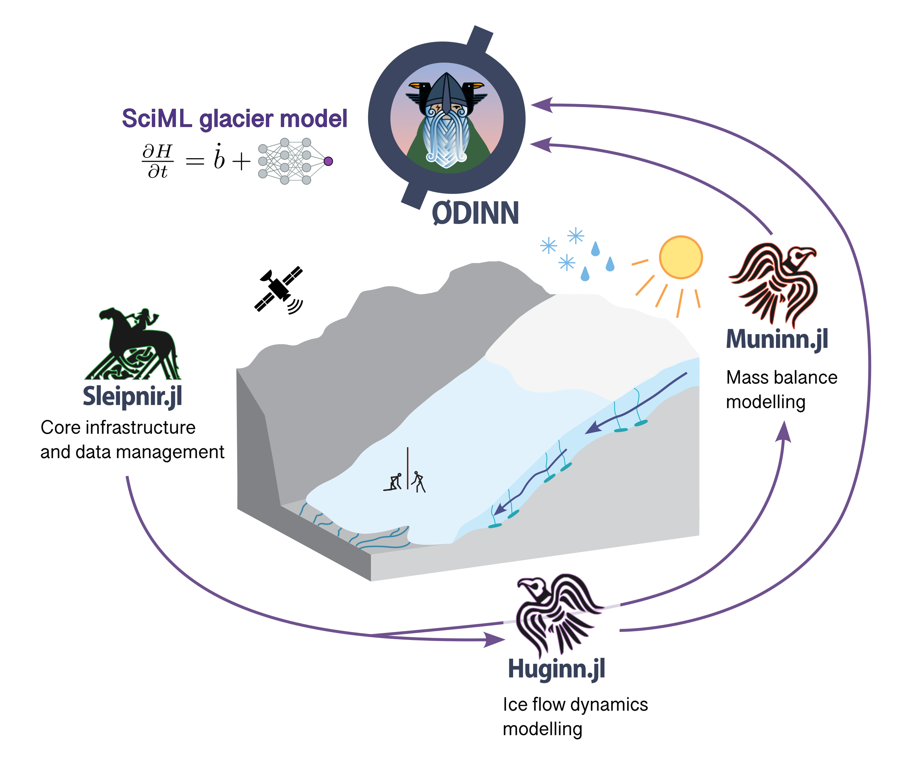

# ODINN.jl

[](https://github.com/ODINN-SciML/ODINN.jl/actions/workflows/CI.yml?query=branch%3Amain)
[](https://app.codecov.io/gh/ODINN-SciML/ODINN.jl)
[](https://github.com/ODINN-SciML/ODINN.jl/actions/workflows/CompatHelper.yml)

[](https://odinn-sciml.github.io/ODINN.jl/)
[](https://doi.org/10.5281/zenodo.8033313)


## About ODINN.jl

`ODINN.jl` is a glacier model leveraging scientific machine learning (SciML) to perform forward and inverse simulations of glacier evolution at regional to large scales. It couples ice flow dynamics and surface mass balance in a modular, fully differentiable Julia framework, so that any model component (an initial state, a physical parameter, or a whole empirical law) can be optimized against observations.

Its core approach is Universal Differential Equations (UDEs): partial differential equations describing glacier physics, where unknown or subgrid processes are replaced by data-driven regressors such as neural networks. This makes it possible to learn new parametrizations of processes like ice creep, basal sliding or surface mass balance directly from remote sensing data, while preserving the physical structure of the model. For the method, see [our paper in Geoscientific Model Development](https://gmd.copernicus.org/articles/16/6671/2023/gmd-16-6671-2023.html).

<center></center>

> **Overview of the ODINN ecosystem**. `Gungnir` preprocesses the glacier and climate data (topography, ice thickness and velocity observations, climate) and `Sleipnir.jl` provides the core infrastructure and data management. `Muninn.jl` (surface mass balance) and `Huginn.jl` (ice flow dynamics) model the two main components of glacier evolution, and `ODINN.jl` couples them in a differentiable SciML model, where components such as a neural network can be optimized against observations.

With `ODINN.jl` you can:

  - Run **forward simulations** of glaciers anywhere on Earth, in parallel, with interchangeable ice flow and mass balance models.
  - Model surface mass balance with **temperature-index models**, automatically calibrated against geodetic observations, or with **machine learning models** trained with [MassBalanceMachine](https://github.com/ODINN-SciML/MassBalanceMachine) and ported to Julia with [MassBalanceMachine.jl](https://github.com/ODINN-SciML/MassBalanceMachine.jl).
  - Perform **classical inversions** of the initial state and of model parameters (e.g. the Glen coefficient `A`), scalar or gridded.
  - Perform **functional inversions** with UDEs, training neural networks embedded in the model, using manual or automatic (SciMLSensitivity.jl) adjoints.

## The ODINN ecosystem

`ODINN.jl` is the top layer of an ecosystem of packages, each one with a narrow role. Each can be used independently, or together through `ODINN.jl`.

| Package | Role |
|---|---|
| [Gungnir](https://github.com/ODINN-SciML/Gungnir) (Python) | Preprocesses glacier and climate data with [OGGM](https://github.com/OGGM/oggm) |
| [Sleipnir.jl](https://github.com/ODINN-SciML/Sleipnir.jl) | Core data structures: glaciers, climate, parameters, laws, results |
| [Muninn.jl](https://github.com/ODINN-SciML/Muninn.jl) | Temperature-index mass balance models and their calibration |
| [MassBalanceMachine.jl](https://github.com/ODINN-SciML/MassBalanceMachine.jl) | Machine learning mass balance models trained in Python and ported to Lux.jl |
| [Huginn.jl](https://github.com/ODINN-SciML/Huginn.jl) | Ice flow models and PDE solvers |
| **ODINN.jl** | Differentiable pipeline for inversions and UDE training |

## Installing ODINN

> `ODINN.jl` requires Julia v1.11.

In order to install `ODINN` in a given environment, just do in the REPL:
```julia
julia> ] # enter Pkg mode
(@v1.11) pkg> activate MyEnvironment # or activate whatever path for the Julia environment
(MyEnvironment) pkg> add ODINN
```

The preprocessed glacier and climate data (generated with Gungnir) are downloaded automatically the first time the ecosystem is precompiled. You only need to run Gungnir yourself for glaciers that are not in the preprocessed dataset, or for custom climate sources, see the [documentation](https://odinn-sciml.github.io/ODINN.jl/dev/glaciers/).

## How to use ODINN

The following example runs a forward simulation for one glacier between 2000 and 2020. The temperature-index mass balance model is calibrated automatically against the geodetic mass balance of [Hugonnet et al. (2021)](https://doi.org/10.1038/s41586-021-03436-z), so no parameter needs to be set by hand.

```julia
using ODINN

# Define the working directory
working_dir = joinpath(ODINN.root_dir, "demos")
mkpath(working_dir)

# Glaciers to simulate, identified by their RGI ID (here, Argentière)
rgi_ids = ["RGI60-11.03638"]

# Create the necessary parameters
params = Parameters(
    simulation = SimulationParameters(
        working_dir = working_dir,
        tspan = (2000.0, 2020.0),
        multiprocessing = false,
        rgi_paths = get_rgi_paths()
    )
)

# Ice flow model (2D Shallow Ice Approximation) and mass balance model (temperature-index)
model = Model(
    iceflow = SIA2Dmodel(params),
    mass_balance = TImodel1(params)
)

# Initialize the glaciers with all the necessary data
glaciers = initialize_glaciers(rgi_ids, params)

# Create the simulation, calibrating the mass balance model, and run it
prediction = Prediction(model, glaciers, params)
run!(prediction)

# Visualize the change in ice thickness
plot_glacier(prediction.results[1], "evolution difference", [:H]; metrics = ["difference"])
```

To use a machine learning mass balance model instead, replace the `mass_balance` model with one from MassBalanceMachine.jl, see the [MassBalanceMachine page](https://odinn-sciml.github.io/ODINN.jl/dev/Packages/massbalancemachine/) of the documentation.

To go further, the [documentation](https://odinn-sciml.github.io/ODINN.jl/) includes a [quick start](https://odinn-sciml.github.io/ODINN.jl/dev/quick_start/), tutorials for [forward simulations](https://odinn-sciml.github.io/ODINN.jl/dev/forward_simulation/), [classical inversions](https://odinn-sciml.github.io/ODINN.jl/dev/classical_inversion/) and [functional inversions](https://odinn-sciml.github.io/ODINN.jl/dev/functional_inversion/), a page for each package of the ecosystem, and guides to [extend ODINN](https://odinn-sciml.github.io/ODINN.jl/dev/extending/) with new ice flow models, mass balance models or laws.

## Contributing and community

Contributions are welcome. You can report bugs and request features in the [issues](https://github.com/ODINN-SciML/ODINN.jl/issues) tab, or open a pull request against `dev` from a fork. See [How to contribute](https://odinn-sciml.github.io/ODINN.jl/dev/contribute/) and the [Code of conduct](https://odinn-sciml.github.io/ODINN.jl/dev/code_of_conduct/).

## How to cite

If you use `ODINN.jl`, please cite our paper in [Geoscientific Model Development](https://gmd.copernicus.org/articles/16/6671/2023/gmd-16-6671-2023.html):
```
@article{bolibar_sapienza_universal_2023,
	title = {Universal differential equations for glacier ice flow modelling},
	author = {Bolibar, J. and Sapienza, F. and Maussion, F. and Lguensat, R. and Wouters, B. and P\'erez, F.},
	journal = {Geoscientific Model Development},
	volume = {16},
	year = {2023},
	number = {22},
	pages = {6671--6687},
	url = {https://gmd.copernicus.org/articles/16/6671/2023/},
	doi = {10.5194/gmd-16-6671-2023}
}
```

## Funding

The ODINN project has been funded by the Nederlandse Organisatie voor Wetenschappelijk Onderzoek, Stichting voor de Technische Wetenschappen (Vidi grant 016.Vidi.171.063), a TU Delft Climate Action grant, a PEPR TRACCS grant from the Agence Nationale de la Recherche as part of France 2030 (reference ANR-25-EXTR-0006), the National Science Foundation (grant OPP-2441132 and the EarthCube programme under awards 1928406 and 1928374), the Alfred P. Sloan Foundation (grant FG-2024-21649), and the MIAI cluster and the Agence Nationale de la Recherche in the context of France 2030 (grant ANR-23-IACL-0006).
